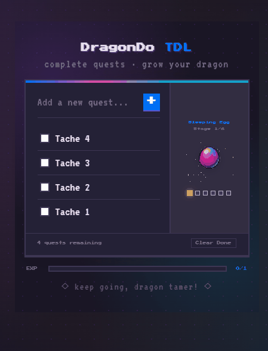

<div align="center">

# DragonDo TDL

### *complete quests · grow your dragon*


**DragonDo** is a gamified to-do list where every completed task evolves your dragon companion.  
Turn your productivity into an adventure — check off quests, watch your egg hatch, and grow a dragon! 

</div>

---

# App Preview

<p align="center">
  
</p>

---

# Features

- **Quest Management** — Add, complete, and clear tasks easily
- **Dragon Evolution** — Your dragon grows through **6 unique stages** as you complete quests
-  **EXP Bar** — Visual XP bar tracks your session progress
-  **Pixel Art Sprites** — Custom pixel art assets for each dragon stage
-  **No dependencies** — Pure HTML, CSS & JavaScript, zero frameworks
-  **Dark theme** — Easy on the eyes, built for focus

---
#  How It Works

Each completed task increases your progress.

Progress	Dragon Stage
0%	Egg
20%	Egg cracking
40%	Shell breaking
60%	Hatching
80%	Baby dragon
100%	Small dragon


# Project Structure

```
DRAGODO/
├── assets/
│   ├── baby-dragon.png     # Stage 5 sprite
│   ├── dragon-head.png     # Stage 6 sprite
│   ├── dragon.png          # Dragon asset
│   ├── egg-crack1.png      # Stage 2 sprite
│   ├── egg-crack2.png      # Stage 3 sprite
│   └── egg.png             # Stage 1 sprite
├── index.html              # App structure & layout
├── style.css               # Dark pixel-art theme
├── script.js               # Quest logic & dragon evolution
└── README.md
```

---

# Getting Started

No install needed — it's pure vanilla web!

```bash
# 1. Clone the repo
git clone https://github.com/yourusername/dragondo-tdl.git

# 2. Open in your browser
cd dragondo-tdl
open index.html
```

Or just **drag & drop** `index.html` into your browser. That's it! 

---

# How to Play

1. **Add a quest** — Type your task and press `+` or hit `Enter`
2. **Complete quests** — Check the box next to a task when done 
3. **Watch your dragon evolve** — Dragon sprite updates as you progress
4. **Clear Done** — Remove completed quests to keep your list clean
5. **Fill the EXP bar** — Complete everything to reach Stage 6!

> 💡 *The more quests you complete, the further your dragon evolves. Finish them all to unlock the* **Small Dragon!!**

---

#Tech Stack

| | Technology |
|-|------------|
| Structure | HTML5 |
| Styling | CSS3 (custom dark theme, pixel font) |
| Logic | Vanilla JavaScript |
| Fonts | Press Start 2P · VT323 (Google Fonts) |
| Art | Custom pixel art sprites |

---

# License

MIT License — feel free to use, modify and share.

---

<div align="center">

**◇ keep going, dragon tamer! ◇**


</div>
